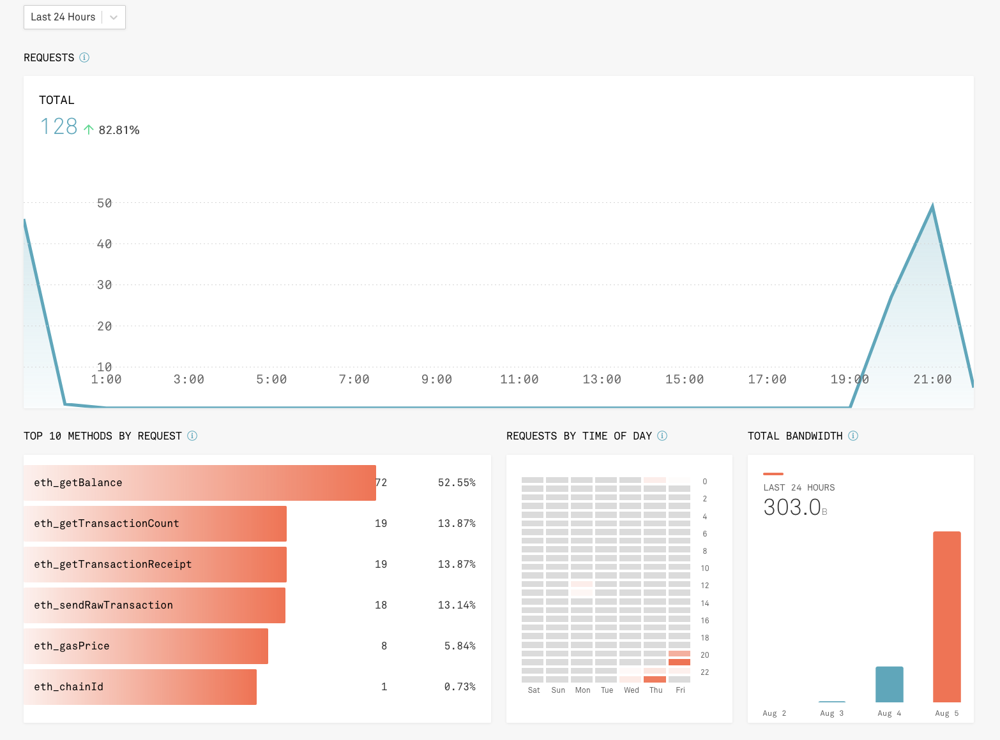

# NewBank README

### **Ethereum Wallet Functionality:**

#### **Accessing API**

The wallet connects to an API provider called Infura that handles the actual communication with the Ethereum network  
Log in here:
https://infura.io/login (Credentials provided separately.)

Click Ethereum in the left toolbar

This screen shows you the projects created for this account. It also displays some overall stats for the account.
As you can see the API allows 100,000 transactions a day.

Select the NewBank project to see a breakdown of the types of requests made and when they were made. 

### Crediting your address with test Ether

This application uses an Ethereum test network called Goerli, so we don't need real Ether to use it.
In order to credit an address (think account number in traditional finance) with test Ether you need to use what is known as a faucet.
You can find the Goerli faucet here:
https://www.rinkeby.io/#faucet  
It's very straightforward and instructions on how to use are on the page.
However there are already two users in the database with already credited wallets.

### Test Users

Name: Jack Ryan  
Login Credentials:  
Login ID: jack1970  
Password: password 
Ethereum Address: 0xfbdefb7dde102721efba7570572b6c12b6df887a
Ethereum Password: password

===========================

Name: Josie Miller  
Login Credentials: 
Login ID: jmiller  
Password: password  
Ethereum Address: 0xee3bb22de90c5d2319a9a6dfa7e0d69098892d52  
Ethereum Password: password

Note: users are required to set up a separate password to access their Ethereum wallet.  
When Ethereum wallets are created they are stored in the ethereum_wallet table using the userId as a primary key.

### Ethereum Functionality within NewBank

From the main menu there are 3 options relating to Ethereum:  
 - Create Ethereum Wallet - Allows the user to create a new Ethereum Wallet
 - Show Ethereum Wallet - Retrieve the address and current balance of an Ethereum Wallet
 - Transfer Ether - Sends Ether from the currently logged-in users address to another specified address. Following the steps outlined will produce what is known as a transaction 
hash, which can be viewed using a block explorer as described below.

### Blockchain Explorer

You can copy any wallet address or transaction hash and paste it into the test networks block explorer:  
https://goerli.etherscan.io/  
This will allow you to view information relating to specific transactions and address and prives that the application is communicating with the real external network.

For example these are the addresses of our two test users:
 - Jack Ryan - https://goerli.etherscan.io/address/0xfbdefb7dde102721efba7570572b6c12b6df887a
 - Josie Miller - https://goerli.etherscan.io/address/0xee3bb22de90c5d2319a9a6dfa7e0d69098892d52
 - Here is a transaction where I transferred 3 Eth from Jack to Josie - https://goerli.etherscan.io/tx/0x36d55c88fbba351b0a61831a1846b8c603bb5e2d22a9b6c7bdc9e5020a37ccf6

### Useful resources:

Web3j Java library docs - http://docs.web3j.io/latest/  
Infura API docs - https://infura.io/docs/ethereum  

Useful blog posts:

https://greg.jeanmart.me/2020/05/01/manage-an-ethereum-account-with-java-and-web3j/#  
https://medium.datadriveninvestor.com/block-chain-using-java-and-ethereum-part-i-c225f33064d8  
https://medium.com/datadriveninvestor/block-chain-using-javas-web3j-and-ethereum-part-ii-create-or-open-an-account-896cf3b5ef12  
https://medium.datadriveninvestor.com/blockchain-using-java-part-iii-transaction-of-ethers-from-one-account-to-another-using-web3j-861c39e7a5e1  

